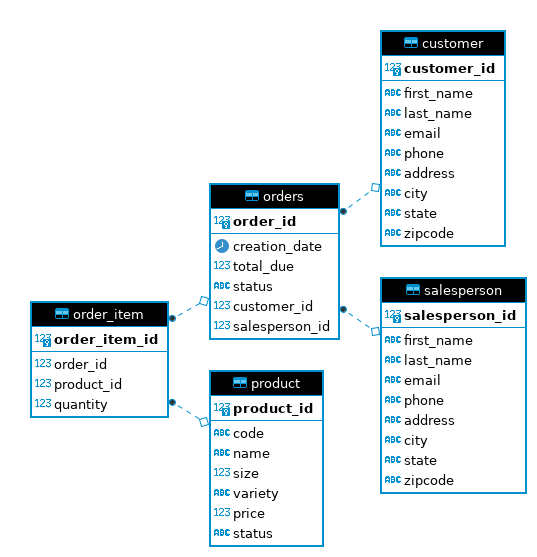

# Introduction

This project involves retrieval of data from a retail database.
It focuses mainly on CRUD (Create Read Update Delete) operations
executing against the database. The database is managed by Postgresql,
which is a relational database management system. The Postgresql 
instance itself was provisioned via Docker. The project was written
exclusively in Java, with dependencies being managed by Maven. 
The connection between the application and the database was handled
by JDBC.

# Implementation

## ER Diagram

## Design Patterns

The project sees use of both the DAO and Repository design patterns.
The CustomerDAO class is best defined as following the Repository
pattern, as it only interacts with the customer table. Repository
pattern is horizontally scalable, as it provides for a separation of
concerns that the DAO pattern cannot. The OrderDAO follows the DAO
pattern, which excels at handling join-heavy queries and normalized
databases. The Repository pattern focuses on a single table per class,
and as such, joins between tables is rather counter-intuitive to its
purpose. That's where DAO comes in.

# Testing

Utilizing the databse GUI tool DBeaver, database structure and query
outcomes were tested. The retrieval of results from the database via
JDBC was tested by formatting output in SQL-style query output to gauge
whether the data retrieved was similar to that queried on DBeaver.
