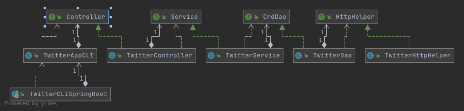

# Introduction

The Twitter CLI app allows for users to either send tweets,
get tweets, or delete tweets on the command line interface.
This project consisted of sending requests to the Twitter REST
API and retrieving responses from it via HttpClient. It then uses
the Jackson library to convert retrieved tweets in JSON format
to a corresponding Tweet object. The object is then used to output
data from the tweet, whether filtered or not. The project was managed
and packaged by Maven and has been deployed via Docker.

# Quick Start

To package the app via Maven:

```bash
mvn clean package spring-boot:repackage -DskipTests
```

To run the app on docker:

```bash
docker run -rm /
-e consumerKey="consumerKey goes here" /
-e consumerSecret="consumerSecret goes here" /
-e accessToken="accessToken goes here" /
-e tokenSecret="tokenSecret goes here" /
habibmoh9085/twitter "post/show/delete" "text longitude:latitude/show id [fields]/delete id,...,ids"
```
Note above that the arguments for the program are ordered such
that each command's order is respective to their set of parameters.

# Design

## UML Diagram


## Components

### TwitterCLIApp

This is in charge of directing program 
execution according to what command was passed in as an argument.

### Controller
This is in charge of actually vetting out the arguments passed
in and preparing them to be passed to the service layer.

### Service
This is in charge of making sure the provided arguments are
compliant to Twitter API standards, as well as handling 
filtering fields in the case of the show tweet command.

### DAO
This is in charge of building URIs to pass to the HttpHelper
layer, as well as converting the resulting response to a 
Tweet object.

### HttpHelper
This is in charge of sending post/get requests with the 
provided arguments as well as authorization header.

## Models

### Tweet
The Tweet class was meant to embody a filtered version of
the actual tweet that returns from a Twitter API response.
It consists of:
- Id in numeric and string formats
- Creation date
- Coordinates (see below)
- Entities (see below)
- Retweet and favorite counts
- Whether the tweet has been favorited or retweeted
- The actual text of the tweet

### Entities
The Entities class corresponds to the entities object from
the Twitter API. It consists of:
- An array of Hashtags (see below)
- An array of User Mentions (see below)

### Coordinates
The Coordinates class corresponds to the coordinates object
from the Twitter API. It gives data on the location a tweet
was sent. It consists of:
- An array holding longitude and latitude
- The type of measurement

### Hashtags
The Hashtags class corresponds to the hashtags object from
the Twitter API, and gives information on the hashtags
in the tweet, and where. It consists of:
- The text of the hashtags
- An array signifying where the hashtags starts and ends
	in the text.

### User Mentions
The User Mentions class corresponds to its respective object
in the Twitter API. It gives information on the users that were
mentioned/tagged in the tweet. It consists of:
- The user id, numeric and text
- Where in the text the user was mentioned/tagged
- The name of the user
- The screen name of the user

## Spring
Using various annotations between the components, as provided
by Spring, such as @Component, @Controller, and @Service, as
well as tagging the constructors with @Autowired, we defined
for Spring what needs to have dependencies injected into them
at runtime. This saved us from the burden of having to instantiate
each dependency in the main class.

# Test
With JUnit, we executed integration test for each component and
check for overall valid program flow.
With Mockito, we conducted unit tests on the component to make
sure the functions in them properly navigated through failed and
successful scenarios.

# Deployment
We first packaged the program into a jar file, and we didn't
have to worry much about the Maven dependencies not making it
due to Spring. We then wrote up a Dockerfile and built an image
of the program. We pushed the image to DockerHub after testing.

#Improvements

- The tests could be more comprehensive and abstract
- Allow for multiple tweets to be fetched
- Develop a show latest five/ten tweets function
