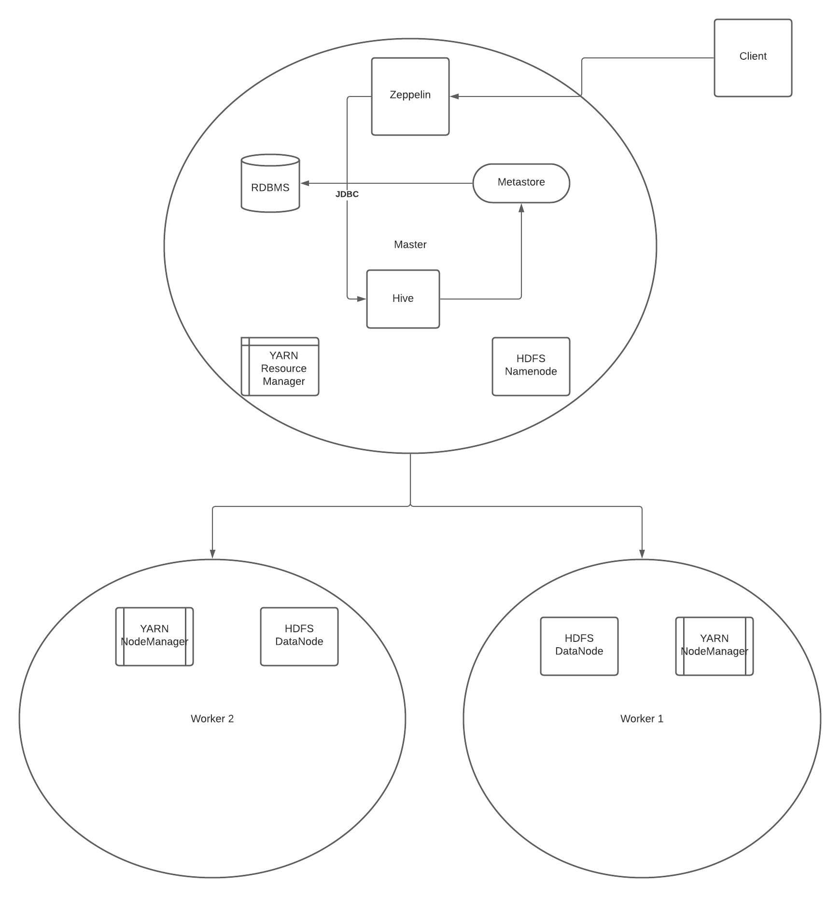

### Table of Contents
* [Introduction](#Introduction)
* [Hadoop Cluster](#HadoopCluster)
* [Hive Project](#HiveProject)
* [Improvements](#Improvements)

# Introduction

The data analytics team at Jarvis wanted to switch from SAP and R to modern-day big data solutions. Thus, this project is an evaluation of Hadoop, Hive, MapReduce, YARN, Zeppelin Notebook, and even Spark as big data platforms and tools. A Hadoop cluster was provisioned from Google Cloud Platform in order to explore its capabilities. The dataset used to leverage the Hadoop cluster was the 2016 World Development Indicators (WDI) data catalog, which had data on development indicators dating back from around 1960 to 2016. The data was stored and managed by the Hadoop Distributed File System (HDFS), interactions with data in RDBMS-like fashion was made possible thanks to Hive/Beeline. YARN was instrumental in resoure allocation, job assignment, etc, which allows for different data processing methods, whether its MapReduce or Spark.

# Hadoop Cluster

The Hadoop cluster provisioned via GCP was instantiated with 1 master node and 2 worker nodes. Each node has 2 CPUs with 13 GB of memory. They each have a primary disk size of 100 GB.

# Hive Project

When starting off with working on Zeppelin Notebook, a table was created with the default Serializer/Deserializer (Serde), LazySimpleSerde. The Serde treated every comma as a delimiter. This came up as an issue, as commas incased within quotes ("") were treated as a delimiter, thus causing incorrect data being displayed in columns. To resolve this, the OpenCSVSerde was provisioned, which ignored any commas incased within quotes, and thus properly displayed data in columns. Something noted was that using Hive to count rows in a file was very inefficient compared to utilzing Bash commands to count lines in the same file. Exploring querying the table for specific data, such as finding the GDP growth of a country in a certain year, the query executed successfully, but took quite some time. Creating a table that dynamically partitioned the data based on year, we ran the query again on this partitioned table and noted that the execution time was much faster, as the search area was much smalller. Using Parquet, we tested the concept of storing data in a column-oriented, or columnar table. We found that its performance was better than the row-oriented tables we were using prior. We then tested out queries that relied on inner
joins and compared the Hive performance to that of Spark Sql. We found that Spark performed fairly faster. We finally tested out the performance of sorting data, and found that Hive could comfortably handle that within reasonable time.

# Improvements
- Dig more into where columnar tables don't perform too well
- Test the bucket concept
- Test out other alternatives to Spark and Hive

