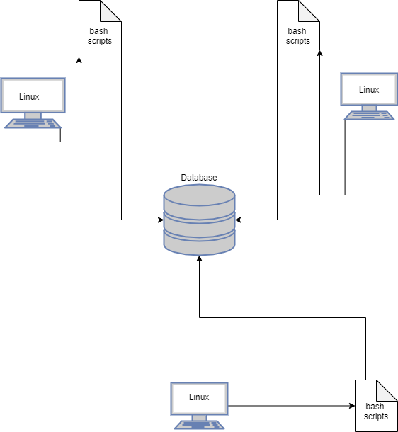

# Introduction
The Linux Cluster Monitoring Agent, or LCMA for short, was designed to monitor and debrief on
the specifications, activity, and performance of Linux machines within a cluster. 
The project involves grabbing information on the physical attributes of a Linux machine, such as
the number of cores it has, the total amount of memory it holds, etc. It also grabs information related
to the state of the machine every minute or so, including the amount of I/O operations ongoing, 
the amount of memory used, etc.
This project is primarily meant for Linux Cluster Administrators who are responsible for making sure the Linux-based
machines operate smoothly to maintain the stability of the cluster. This project makes use of Linux
Bash scripting and PostgreSQL via Docker to grab information from Linux machines and
store them within database tables. Version control and workflow follows Git and GitFlow conventions.

# Quick Start

## Starting a PostgreSQL instance
```bash
scripts/psql_docker.sh create db_username db_password
```

## Initalizing Tables
```bash
psql -h psql_host -U db_username -d host_agent -f sql/ddl.sql
```

## Inserting Hardware Specification Data
```bash
scripts/host_info.sh psql_host psql_port host_agent db_username db_password
```
## Inserting Hardware Usage Data
```bash
scripts/host_usage.sh psql_host psql_port host_agent db_username db_password
```
## Cron Job Setup
```bash
#Open crontab jobs file to edit
crontab -e
#Add the following to the file
* * * * * bash path/to/linux_sql/scripts/host_usage.sh 
psql_host psql_port host_agent db_username db_password > /tmp/host_usage.log
```

# Implementation
To start off, the first feature developed was the psql_docker.sh script, which allowed for a 
PostgreSQL container to be created, and switched on or off depending on the need for it.
Then, the database host_agent was set up using the PostgreSQL CLI. Next, the ddl.sql script
was developed, as it allowed for the tables host_info and host_usage to be setup within the database.
Then the scripts in charge of inserting data into the tables, host_info.sh and host_usage.sh,
were developed, along with setting up host_usage.sh as a crontab job. Finally, queries.sql was
developed in order to return information based on the data that had accumulated.

# Architecture


# Scripts

## psql_docker.sh
psql_docker.sh was developed in order to create/start/stop a PostgreSQL container.
```bash
#To create a container
scripts/psql_docker.sh create db_username db_password

#To start the container
scripts/psql_docker.sh start

#To stop the container
scripts/psql_docker.sh stop
```

## host_info.sh
host_info.sh is in charge of grabbing data on hardware specifications from a Linux machine.
```bash
#To grab the current machine's info and store it into a database table
scripts/host_info.sh psql_host psql_port host_agent db_username db_password
```

## host_usage.sh
host_usage.sh is in charge of grabbing data on machine status/performance at the time
```bash
#To grab the current machine's info and store it into a database table
scripts/host_usage.sh psql_host psql_port host_agent db_username db_password
```

## crontab
crontab is utilized in order to run the host_usage.sh script every minute
```bash
#To setup host_usage.sh to be a crontab job:

#Open crontab jobs file to edit
crontab -e
#Add the following to the file
* * * * * bash path/to/linux_sql/scripts/host_usage.sh 
psql_host psql_port host_agent db_username db_password > /tmp/host_usage.log
```

## queries.sql
queries.sql is meant to provide answers to the following questions:
1) Which machine has the most memory
2) How much memory on average each machine uses over 5-minute intervals
3) How to detect machine failure by means of update rate
```bash
#To use queries.sql:
psql -h psql_host -U db_username -d host_agent -f sql/queries.sql
```

# Database Modeling
The schema for table host_info looks something like this:

id	| hostname	| cpu_number	| cpu_architecture	| cpu_model	| cpu_mhz	| L2_cache	| total_mem	| timestamp
----|-----------|---------------|-------------------|-----------|-----------|-----------|-----------|-----------
Serial	| Varchar	| Integer	| Varchar	| Varchar	| Float	| Integer	| Integer	| Timestamp

The schema for table host_usage looks something like this:

timestamp	| host_id	| memory_free	| cpu_idle	| cpu_kernel	| disk_io	| disk_available
------------|-----------|---------------|-----------|---------------|-----------|---------------
Timestamp	| Serial	| Integer	| Float	| Float	| Integer	| Integer

# Testing

The testing procedure for bash scripts followed these steps:
1) If the script relied on a certain number CLI arguments, checks were made to ensure the script
	proceeded to run only with the correct amout of arguments.
2) Any variables that were reliant on the result of a bash command had the bash command previously
	tested on its own in a terminal to ensure accurate results.
3) Any SQL commands built within the bash script was tested on the psql command line to ensure
	accurate results.

The testing procedure for SQL scripts largely involved either utilizing the psql command line
or the DBeaver interface to ensure the queries operated as desired.

# Improvements

1) Calculate if workload across all machines is balanced
2) Automate database table creation with the inital setup of host_agent
3) Automate crontab job setup
