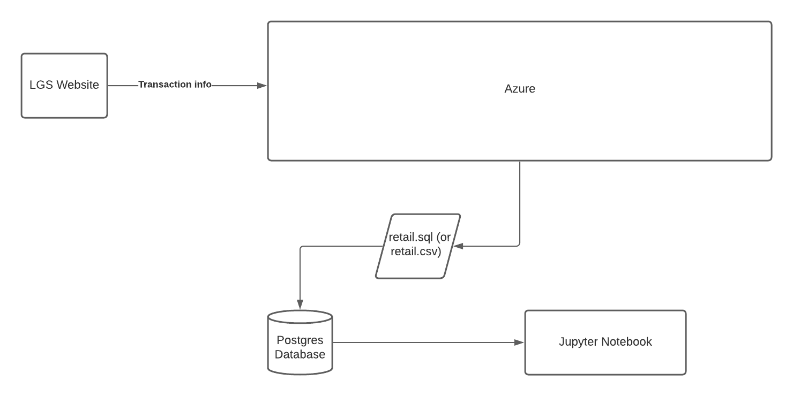

# Introduction

This project involves delivering a Proof of Concept to the London Gift Shop marketing team that analyzes marketing data they provide for customer retention purposes. The marketing
team also plans to design marketing campaigns based on the analysis provided by the project. The project has the capability of mainly grabbing data through a Postgresql database
(the sql files being provided by London Gift Shop). The option to utilize CSV files is also present but not expanded on. Docker is used to provision not only the Postgresql 
database, but also Jupyter Notebook, which is where the Python code was written in. The Python libraries primarily used for this project was pandas for data manipulation and 
analysis, with mathplotlib and datetime making an appearance. 

# Implementation

## Project Architecture

The data originates from customers completing transaction, which is handled by LGS' provisioned Azure system. The system internally handles storage, and has the capability of 
generating a .csv or .sql file of the data via ETL/ELT. The .sql file, which is what this project mainly works with, will be run on the Postgresql database and stored. The Jupyter
notebook then retrieves all the data from the Postgresql database via the pandas module.

## Data Analysis and Wrangling

[Referencing the analysis done in this Jupyter notebook](./python_data_wrangling/retail_data_analytics_wrangling.ipynb)

The group that stands out is the Can't Lose segment. While their recency stats aren't too impressive at the mean, they account for one of the higher frequent-buying segements, and
they also have one of the higher monetary spending means. Marketing campaigns aimed primarily at this segment has the potential to yield much results.

# Improvements
 - Provide charts with projected behavior of some segments
 - Analyze stock popularity
 - Fully incorporate .csv option
