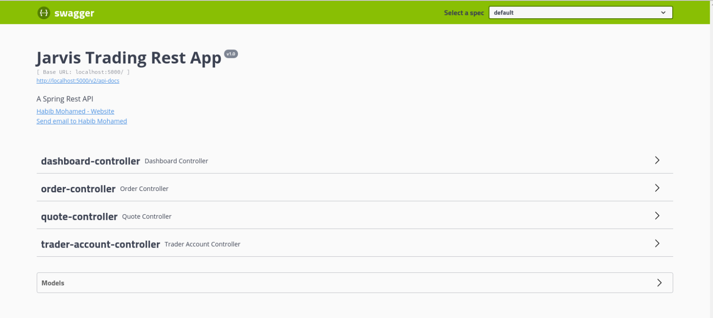
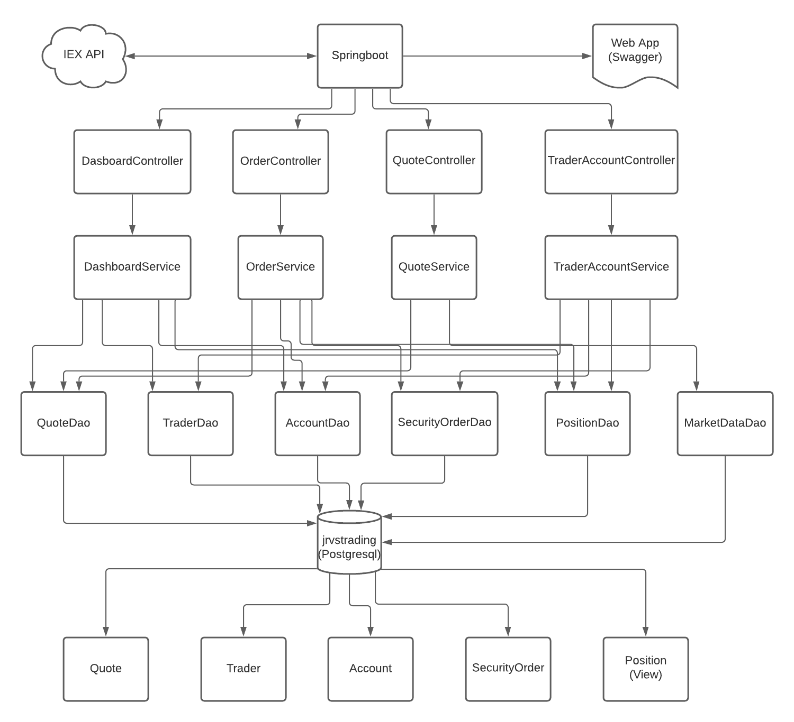
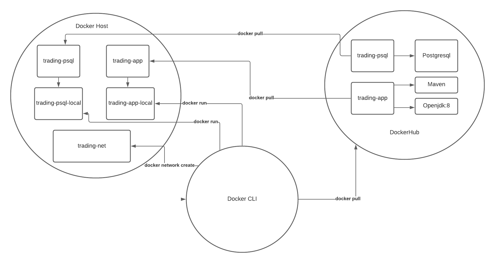

## Table of Contents
* [Introduction](#Introduction)
* [Quick Start](#QuickStart)
* [Implementation](#Implementation)
* [Test](#Test)
* [Deployment](#Deployment)
* [Improvements](#Improvements)

# Introduction

This project is an initiative spearheaded by the Jarvis trading team to replace their legacy trading system with a more modern one. It is a Proof of Concept that grabs
data on stocks via the IEX API, and stores them within a Postgresql database provisioned via Docker. A trader can make an account within the trading system, deposit and 
withdraw sums of money, update the data within the database via IEX API, as well as add more stocks to keep track of. The trader can also put in a market order, whether buying
or selling, and they can view their profile and portfolio. The trading system was developed with Java, utilizing the Spring Boot framework. Project and dependency management is
handled by Maven, and database connections is managed by JDBC. Testing was done largely with JUnit and Mockito. 

# Quick Start

## Prerequistes

- Docker 17.05 or higher
- IEX access token

## Setup

```bash
#Download images
docker pull habibmoh9085/trading-psql
docker pull habibmoh9085/trading-app

#Setup network
docker network create --driver bridge trading-net

#Run database
docker run -d --rm --name trading-psql-local \
-e POSTGRES_PASSWORD=password \
-e POSTGRES_DB=jrvstrading \
-e POSTGRES_USER=postgres \
--network trading-net \
-p 5432:5432 habibmoh9085/trading-psql

IEX_PUB_TOKEN="YOUR_TOKEN"

#Run app
docker run -d --rm --name trading-app-local \ 
-e "PSQL_HOST=trading-psql-local" \
-e "PSQL_PORT=5432" \
-e "PSQL_USER=postgres" \
-e "PSQL_DB=jrvstrading" \
-e "PSQL_PASSWORD=password" \
-e "IEX_PUB_TOKEN=${IEX_PUB_TOKEN}" \
--network trading-net \
-p 5000:5000 habibmoh9085/trading-app
```

## A Look at the App in Action

The app should be running on https://localhost:5000/swagger-ui.html



# Implementation

## Architecture



At the base level, we have the jrvstrading database. This consists of the following tables:
- Quote, which holds information about a given stock and various price-related information
- Trader, which holds information about the trader
- Account, which holds information about what trader it belongs to and the balance it holds
- SecurityOrder, which holds information about market orders
- Position, a view that showcases an account and the sum of orders.

The Dao layer is in charge of interacting with the database, and will directly conduct the database operations. It will map the results from the database operations to 
the classes classified as models. These entities are then passed back up to the Service layer. 

The Service layer conducts business logic checks on incoming data before passing it down to the Dao layer. It will also format entities returned from the Dao layer if
necessary. The data is then passed back up to the Controller layer.

The Controller layer is in charge of setting up the endpoints that the user can send requests to. The data from the Service layer is returned and output its rightful 
endpoint as a response. The Controller layer sends information back in JSON format.

The role of Springboot in this whole affair is to start up a Tomcat server that allows the application to listen for requests. It also handles dependencies between the layers
by means of Inversion of Control (IoC) and dependency injection. It is also in charge of showcasing the actual web app with the help of Swagger.

The IEX API is used to obtain data on the provided ticker. It is also contacted whenever the data in the database is requested to be updated.

## REST API Usage

### Swagger

Swagger is a UI that allows for developers to interact with APIs without hard-coding pages for the endpoints. This has the benefit of testing and utilizing endpoints without
extra cost.

### QuoteController

The QuoteController is responsible for handling endpoints related to the management of stocks that the trader is interested in. Real time data about a stock is requested
from the IEX API and stored within the database. The database houses a subset of the data returned by the IEX API according to the minimum need.
Endpoints include:
- GET /quote/iex/ticker/{ticker} : Gets data on a stock from the IEX API based on the ticker provided.
- PUT /quote/iexMarketData : Updates all the data in the database with recent data from the IEX API.
- PUT /quote/ : Puts a single quote object into the database.
- POST /quote/tickerId/{tickerId} : Saves a quote from the IEX API via the tickerId into the database.
- GET /quote/dailyList : Gets all the quotes in the database.

## TraderAccountController

The TraderAccountController handles endpoints related to the creation of accounts, deposits, and withdrawals.
Endpoints include:
- POST /trader/firstname/{firstname}/lastname/{lastname}/dob/{dob}/country/{country}/email/{email} : Uses information passed in URL to build and save a trader and their
account into the database.
- POST /trader/ : Creates and saves information into the database on a trader and their account using the Trader object provided.
- DELETE /trader/traderId : Deletes a trader and everything dependent on it from the database via the trader ID provided.
- PUT /trader/deposit/traderId/{traderId}/amount/{amount} : Deposits the specified funds into the account specified.
- PUT /trader/withdraw/traderId/{traderId}/amount/{amount} : Withdraws the specified funds from the account specified.

## OrderController

The OrderController handles endpoints related to placing market orders.
Endpoints include:
- POST /order/marketOrder : Submits a buy/sell market order into the database.

## DashboardController

The DashboardController handles endpoints related to viewing profiles and portfolios.
Endpoints include:
- GET /dashboard/profile/traderId/{traderId} : Showcases the profile of the trader given their id.
- GET /dashboard/portfolio/traderId/{traderId} : Showcases the portfolio of the trader given their id.

# Test

The application was put through integration tests with JUnit at the DAO and Service layers, with unit tests set up where applicable with Mockito. The controller layer 
undergone manual tests through API interaction with Swagger UI and Postman. The code coverage for the integration and unit tests saw over 60% line coverage.

# Deployment



The trading-psql image first pulls a postgres image. It then copies the sql directory to its entrypoint directory, so that upon initialization, the sql files in the directory
are automatically executed.

The trading-app image first pull a maven image. It uses maven to package a jar file out of the application. The image then pulls an open-jdk:8 image. Using the
java image, an entrypoint is set up so that when a container of trading-app is run, the jar file is executed.

# Improvements

1. A mechanism to update market data within the database on application start for better daily list.
2. A suite of endpoints for completing existing market orders.
3. Matching buy orders to sell orders of lower price.
